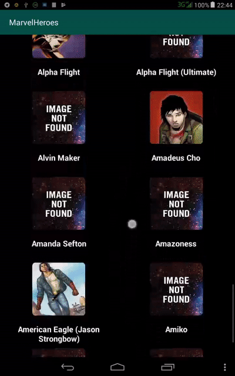
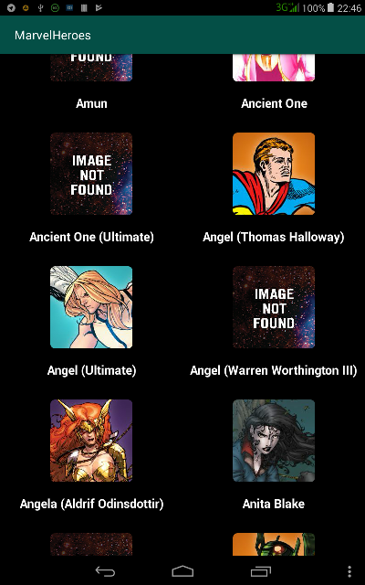
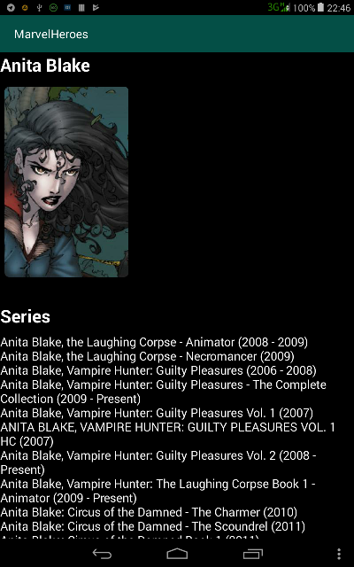
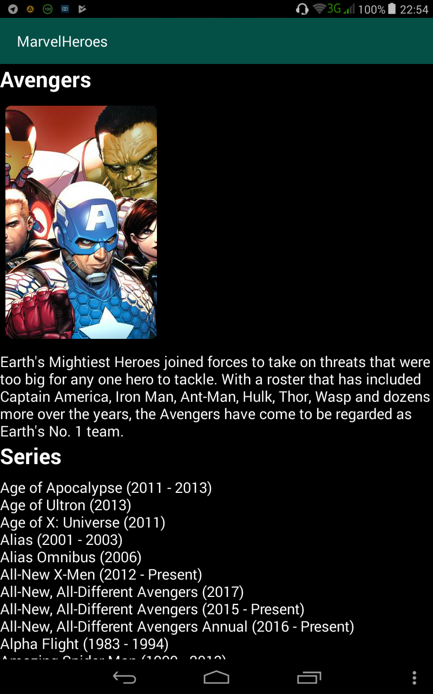

  
  
  
  
Приложение состоит из двух экранов:  
  
* ``MainActivity`` — экран списка героев комиксов.  
  
С помощью ``RecyclerView`` выводятся скругленные портреты героев комиксов по 2 колонки на строку.  
Реализована пагинация (постраничная загрузка данных при скролле к концу списка).  
Также реализован Swipe-to-Refresh.  
  
Для запросов к REST-методам API используется библиотека ``Retrofit``.  
  
По тапу на портрет героя открывается экран просмотра информации о герое.  
  
  
  
  
  
* ``HeroActivity`` — экран просмотра информации о герое комикса.  
  
Отображается полная информация о герое.  
Также реализован Swipe-to-Refresh.  
  
     